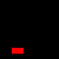
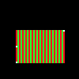

# Lab 1 - Software Rasterizer: Bounding Box

**You must work individually.**

Please download the code for the lab and go over the code.

<a class="btn btn-info" href="https://github.com/calpoly-csc471/lab01">The base code for this lab can be found on GitHub here</a>

## Overview and Context

Over the next 2 weeks, we will be writing a program to render (draw) an indexed face set (aka polygonal mesh of triangles) as an image via software rasterization
(i.e. the code will be entirely written in C/C++ with no graphic libraries. The software will render a static scene).
In general the required steps for the program will be:

- Read in triangles.
- Convert triangles to window coordinates.
- Rasterize each triangle (using barycentric coordinates for linear interpolations and in-triangle test).
- Write color values per pixel (using a z-buffer test to resolve depth).

We will discuss the window coordinate transform, barycentric coordinates and z-buffers in the next few lectures.


## Goals for Today's Lab

For today, we will just be playing with the provided image code to build up functionality that will be useful in your rasterizer.

- Get C++ build working
- Read in three vertices which represent a triangle (see below for details)
- Color all the pixels in the bounding box the color of your choice
- Write out those pixels as a PNG image (code provided)


## Step 1

[If you're using the Windows lab machines (e.g. in 14-255), follow these build and run instructions.]({{ site.baseurl }}/references/cpp-build-vs)

[If you're using the Linux lab machines (e.g. in the CSL), follow these build and run instructions.]({{ site.baseurl }}/references/cpp-build-cmake)

You should see some output on the console.
Look at `main.cpp` to see what the command line arguments mean.
Once you enter the correct arguments, you should see the following output file in the build directory.




## Step 2

Starting with the provided code, make the list of command line arguments take the following options (in exactly this order)

- Output filename (e.g., foo.png)
- Image width (e.g., 512)
- Image height (e.g., 512)
- Vertex 1 x-coord (e.g., 100)
- Vertex 1 y-coord (e.g., 100)
- Vertex 2 x-coord
- Vertex 2 y-coord
- Vertex 3 x-coord
- Vertex 3 y-coord

**Usage:** `Lab01 filename width height vax vay vbx vby vcx vcy`

Thus for example – a valid program execution would look like:

```
./Lab01 out.png 200 200 2 2 50 60 150 170
```

For today only, we will assume the triangle's vertices are in "window coordinates."
In other words, the data values are integer values that range from 0 to the value of width-1 of the window/image (or 0 to the height-1 value of the window/image).
You may choose to have the vertices be 2D (although for the Assignment 1, they will need to be 3D).
You will need to design a data structure to represent the triangle and its vertices.

Draw the three vertices into the image, using three calls to image->setPixel().

The bounding box of the triangle is the box with the extents that will exactly bound that triangle.
You will need to design a data structure to represent the bounding box.
At minimum such a structure needs xmin, xmax, ymin, ymax. Using the provided image code, modify the color of all the pixels in the bounding box to be a color of your choice (which is different then the background).

You can also try a pattern based on the row and/or column.
The three vertices and the bounding box should look something like this:



Write out the modified image and confirm your code is working as expected.
Be sure to try various test cases with vertex positions in various orders.
Make sure the bounding box completely covers the three vertices.

## Lab check

For lab credit you will need to demonstrate your working code on several vertex tuples specified by the instructor or the TA.
