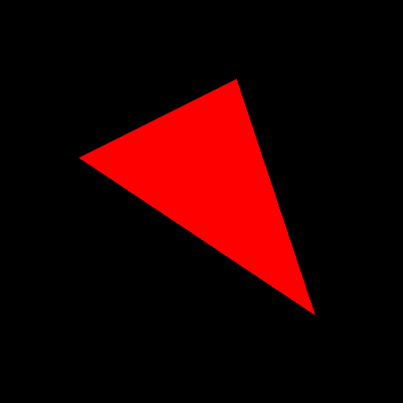
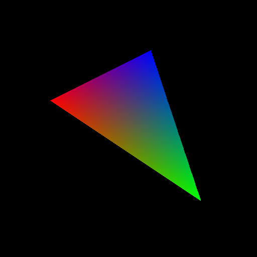

**You must work individually.**

## Overview and Context

For your first assignment, you will be writing a program to render (draw) an indexed face set (aka polygonal mesh of triangles) as an image via software rasterization.
We are continuing to build some basic tools for the assignment.

### Goals for Today's Lab

For today, you will add onto your first lab and only rasterize a single triangle.
Your program must:

- Read in three vertices which represent a triangle.
- Read in different color values to each vertex.
- Compute the bounding box of the triangle using your Lab01 code.
- Compute the barycentric coordinates for every pixel in the bounding box.
- For any pixel that falls in the triangle, color that pixel with the interpolated color using the barycentric coordinates to weight the vertex colors.
- Write out those pixels as a PNG image.

## Step 1

Starting from your Lab01 code, add command line arguments to read-in three different red, green, blue values to the three different vertices.
(Consider differing colors that make a blended color you can reason about such as red and blue or yellow and blue – look up any RGB color chart to pick good colors.)
The command line arguments should be:

- Output filename (e.g., foo.png)
- Image width (e.g., 512)
- Image height (e.g., 512)
- Vertex 1 x-coord (e.g., 100)
- Vertex 1 y-coord (e.g., 100)
- Vertex 1 red (e.g., 255)
- Vertex 1 green (e.g., 0)
- Vertex 1 blue (e.g., 255)
- Vertex 2 x-coord
- Vertex 2 y-coord
- Vertex 2 red
- Vertex 2 green
- Vertex 2 blue
- Vertex 3 x-coord
- Vertex 3 y-coord
- Vertex 3 red
- Vertex 3 green
- Vertex 3 blue

For example:

**Usage:** `.\Lab02 filename width height x0 y0 r0 g0 b0 x1 y1 r1 g1 b1 x2 y2 r2 g2 b2`

## Step 2

Using your prior code, compute the bounding box of the triangle.
Now for every pixel in the bounding box, compute the barycentric coordinates for each pixel.
Please write your own code, refer to the reference provided on the webpage.

Draw the triangle, rather than the bounding box, by using the fact that any pixel that falls within the triangle will have $$ \alpha $$, $$ \beta $$, and $$ \gamma $$ between `0.0` and `1.0`.
For debugging this step, ignore the colors from the previous step and try drawing a red triangle.

## Step 3

For any pixel that will be drawn, its color should be a blend of the colors specified at the triangle vertices.
Blend the colors using $$ \alpha $$, $$ \beta $$, and $$ \gamma $$ that were computed in the barycentric coordinate computation.
See the example figure below for an idea of what your rasterized triangle should look like.

## Lab Check

For lab credit you will need to demonstrate your working code on several vertex tuples specified by the instructor or the TA.
