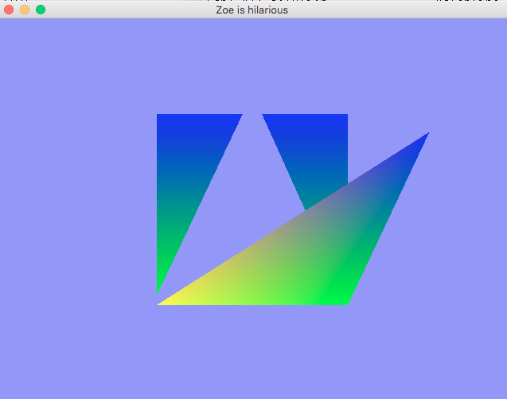

Introduction to glfw, openGL and GLSL – hello triangle(s) and pixel to World mapping

Today we will alter an existing program in order to get started working with OpenGL,
glfw and GLSL. Your goal is to be able to add two new triangles to the scene and to make
one vertex of one triangle be repositioned based on a mouse click.

## Task 1 - setup:

Your first task for today is to make sure you can compile and run a glfw OpenGL
program. All programs from this class from now on must be run locally on the machine
you are physically working on. Take the time now to configure your work environment
to work locally. Note that in general in order to run this program you will need to have:

- the latest graphics driver for your computer (note you should not need to download
  opengl, it came with your computer, but having the latest graphics driver will guarantee
  you are using the most updated version of OGL). <note we are experimenting with using
- **glad** for our extensions manager instead of glew, it should be included in the base code>
- **glfw** installed
- **glm** installed
- **cmake**

Please start by cloning the basecode from here:

[https://github.com/calpoly-csc471/lab03](https://github.com/calpoly-csc471/lab03)

The directions for setting up the lab are found in the README.

## Task 2 – add more triangles and colors:

**1)** Modify the code to add two other triangles to the scene;
you will do this by modifying the .cpp file only.
Then modify the fragment shader to draw blue triangles, so it should look as follows:

Further modify the code to pass in a different color per vertex. You will need to modify
both the `.cpp` file, the vertex shader and the fragment shader.

Your final demo for this part should look like this:

## Task 3 – allow the top vertex of the central triangle to be moved based on mouse input:

**1)** Modify the code first by writing two helper functions:

`float p2wX(int xp)`

`float p2wY(int yp)`

These functions should:

1. take in a coordinate from the mouse,
2. convert the Y coordinate to be a standard pixel Y coordinate
3. convert both the X and Y into world coordinates

**2)** Modify the code such that when the mouse is pressed in the screen, the top
vertex draws wherever the mouse was pressed – for example (updated coloring for fun):

## Demo:

Demo your colored triangles and mouse press movement to the instructor or TA
for lab credit. Also be sure to show your p2wx and p2wy code.

## References:

As a reference you can take a look at these tutorials for some good introductory
information about the libraries we are using (glfw and openGL) and some information
on what the key syntax in the base code is doing:

[opengl-tutorial 1](http://www.opengl-tutorial.org/beginners-tutorials/tutorial-1-opening-a-window/)

and

[opengl-tutorial 2](http://www.opengl-tutorial.org/beginners-tutorials/tutorial-2-the-first-triangle/)

Also in particular, for considering how to add colors – even though it is a 3D cube
example (and we are staying 2D for today), this tutorial is really useful for how to add
colors:

[opengl-tutorial 4](http://www.opengl-tutorial.org/beginners-tutorials/tutorial-4-a-colored-cube/)
