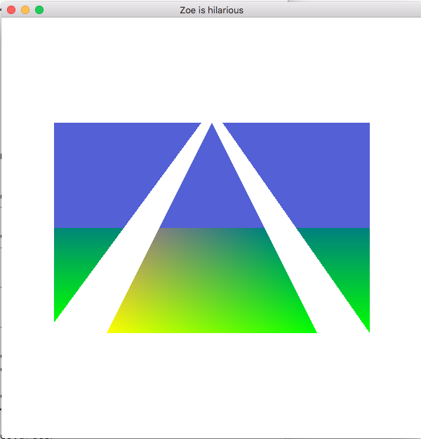
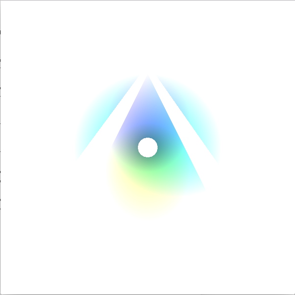
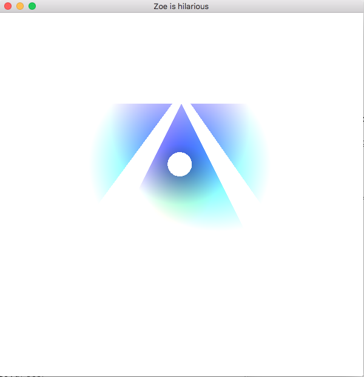
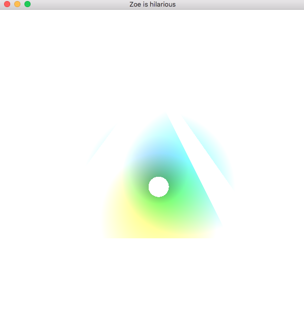
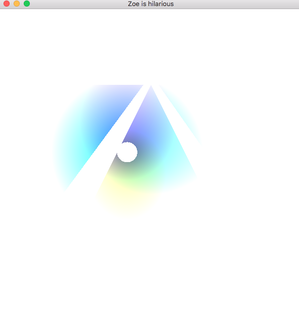

Further introduction to OpenGL and GLSL - playing with color in the fragment shader

Today we will practice controlling the appearance of our geometry via a fragment
shader. In addition, this will require practicing transferring data from the CPU to the
GPU and between shaders.

Starting with your Lab 3 code work through these tasks – you only need to demo task 3
and 4.


## Task 1:

Modify the fragment shader so that any fragments having y values greater then half the window size
are drawn as blue instead of mixed colors colors.

Use GLSL `gl_FragCoord.x` and `gl_FragCoord.y` to test the position,
which are in window coordinates, and then set `gl_FragColor`.

Your output should look something like:



To start, you can hard code the height of the window, but once you get it to work, you
should pass the height of the window as a uniform variable, by calling `glUniform1i(...)`.
(The `i` implies an integer uniform variable.)

Hint: copy and paste the code for the uniform variable `P`.

Also, take a look at [glUniform](https://www.opengl.org/sdk/docs/man/html/glUniform.xhtml) in the OpenGL docs.

Another hint: Use `CHECKED_GL_CALL(...)` to help find GL problems.

```cpp
CHECKED_GL_CALL(glBindBuffer(GL_ARRAY_BUFFER, VertexBufferID));
CHECKED_GL_CALL(glBufferSubData(GL_ARRAY_BUFFER, sizeof(float)*6, sizeof(float)*2, newPt));
CHECKED_GL_CALL(glBindBuffer(GL_ARRAY_BUFFER, 0));
```

Then, google the GL function and the error to get more information.


## Task 2:

Modify the program and shader so that for the center triangle,
any pixels that are less then 20 pixels away from the center of the window are discarded.
You can use the following GLSL calls: `discard` and `distance`.
Your results should look something like this:


## Task 3:

Next, modify the fragment shader, such that all other pixels fade into white in a circular
pattern around this central point (hint think about "adding" a white color to the
fragment color as it gets further away from the center of the triangle). Your result
should look something like this:





## Task 4:

Finally, using the `glfwGetTime()` function to get the current time (in seconds),
move the center point around the window over time.
Using sines and cosines, move this center point in a circular motion centered around the middle of the window.
The center point will need to be passed into the fragment shader as a uniform variable.
Below are three different frames from the program as the center point moves around:

<div class="row">
  <div class="col-sm-4">
    
    <p>
      The center near the top of the middle triangle
    </p>
  </div>
  <div class="col-sm-4">
    
    <p>
      The center has rotated around
    </p>
  </div>
  <div class="col-sm-4">
    
    <p>
      A further rotation of the center
    </p>
  </div>
</div>


