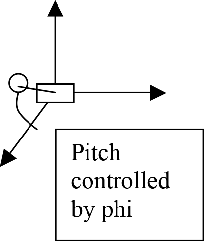
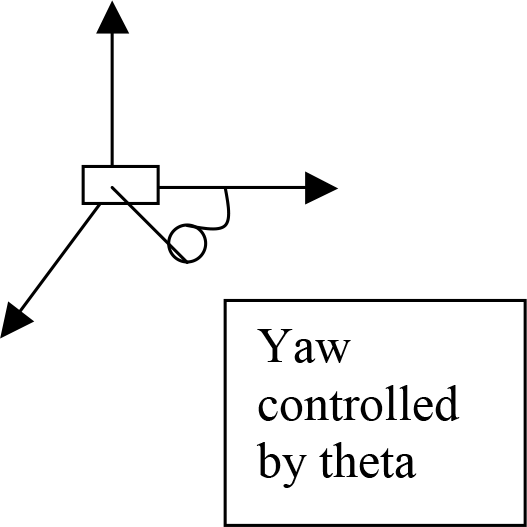

Pitch and Yaw camera control.

Today we will create a very simple scene and enable the user to look all around (180
degrees around and a fix amount up and down).


## Task

Write code for a pitch and yaw camera. We will be using the lookAt function
included in the Matrix Stack helper code, to control the “view” matrix. Please adjust
your code (including your vertex shader) to include a view matrix and pass the matrix
created by the lookAt function to your shader for use as the view matrix.

**1)** Start by setting up a simple scene with at least 4 differently colored objects
(position them in front, to the left, to the right and behind the current camera
position).

---

**2)** Now use mouse input to control the pitch and yaw of where the camera is looking.
Keep the eye position fixed and modify the ‘look at’ point.

---

**3)** Pitch will be controlled by the angle phi, map this to the y motion of the mouse
(consider something reasonable, like mapping the entire height of the scene to a
rotation of 180 degrees). You should be able to keep moving the mouse to
accumulate a total change of 360 degrees.

---

**4)** Yaw will be controlled by the angle theta, map this to the x motion of the mouse
(again consider something reasonable, like mapping the entire width of the scene
to a rotation of 180 degrees). You should be able to keep moving the mouse to
accumulate a total change of 360 degrees.

<div class="row">
  <div class="col-sm-6">
    
  </div>
  <div class="col-sm-6">
    
  </div>
</div>


Given a pitch and yaw angle, you can compute the ‘look at’ location by:

```cpp
x = radius*cos(phi)*cos(theta)
y = radius*sin(phi)
z = radius*cos(phi)*cos(90.0-theta)
```

Please carefully think about what `phi` and `theta` should start out as, and for coding,
convert the degrees to radians. Think about how `phi` and `theta` should change as
you continue to move the mouse and "look around."
