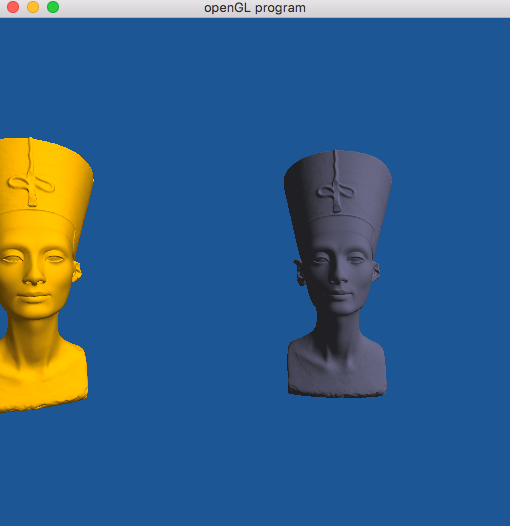
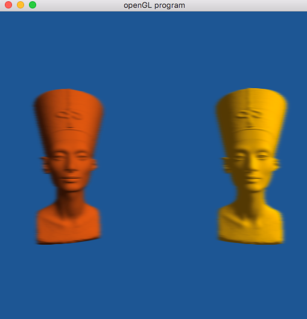

<div class="alert alert-dismissible alert-danger">
  <button type="button" class="close" data-dismiss="alert">&times;</button>
  <h4>Warning!</h4>
  <p>
    The description for this assignment will be changing soon.
  </p>
</div>

**Objective:**  implement pitch and yaw and play with FBO effects.

### Orientation

Your main task is to implement a pitch and yaw camera using the glm lookAt function to control the virtual camera.
The base code includes a scene with several models drawn in a circle around the camera.
Try using the `a` and `d` keys and you will see that the camera can rotate in **y** to look around at the models.
There is also an interesting image based effect that if you click the mouse and scroll the scene will rotate in **y**
and the models will look blurry (more on this in task 2).




## Task 1

Write code for a pitch and yaw camera.
We will be using the lookAt function included in glm, to control the "view" matrix.
Please adjust your code (including your vertex shader) to include a view matrix and
pass the matrix created by the lookAt function to your shader for use as the view matrix.

<div class="row">
  <div class="col-sm-6">
    
  </div>
  <div class="col-sm-6">
    
  </div>
</div>

**1)**
Add a ‘view’ matrix to your main and vertex shader (watch order) and use `glm::lookAt` to generate a view matrix.
Replace the rotation with this matrix and test the functionality.

---

**2)**
Now use mouse input to control the pitch and yaw of where the camera is looking.
Keep the eye position fixed and modify the 'look at' point.

---

**3)**
Pitch will be controlled by the angle `phi`, map this to the **y** motion of the mouse
(consider something reasonable, like mapping the entire height of the scene to a rotation of 180 degrees).
You should be able to keep moving the mouse to accumulate a total change of 360 degrees.

---

**4)**
Yaw will be controlled by the angle `theta`, map this to the **x** motion of the mouse
(again consider something reasonable, like mapping the entire width of the scene to a rotation of 180 degrees).
You should be able to keep moving the mouse to accumulate a total change of 360 degrees.

Given a pitch and yaw angle, you can compute the 'look at' location by:

```cpp
x = radius*cos(phi)*cos(theta)
y = radius*sin(phi)
z = radius*cos(phi)*sin(theta)
```

Please carefully think about what `phi` and `theta` should start out as,
and for coding, convert the degrees to radians.
Think about how `phi` and `theta` should change as you continue to move the mouse and "look around."


## Task 2

Notice that in the base code there is a variable `Moving` that when set,
changes the render of the scene to appear blurry.



This is making use of first rendering to a frame buffer object (think of this as an image of the rendered scene)
and then texturing that data onto a quadrilateral,
but first processing the input image by computing an image blur (only in the horizontal direction).

Look at the code in `main.cpp` and the associated shaders to make sure you understand what is happening.
Next replace the current effect with an alternative effect
(motion blur, Gaussian blur, a bloom effect or any other creative effect to show you understand the process).
