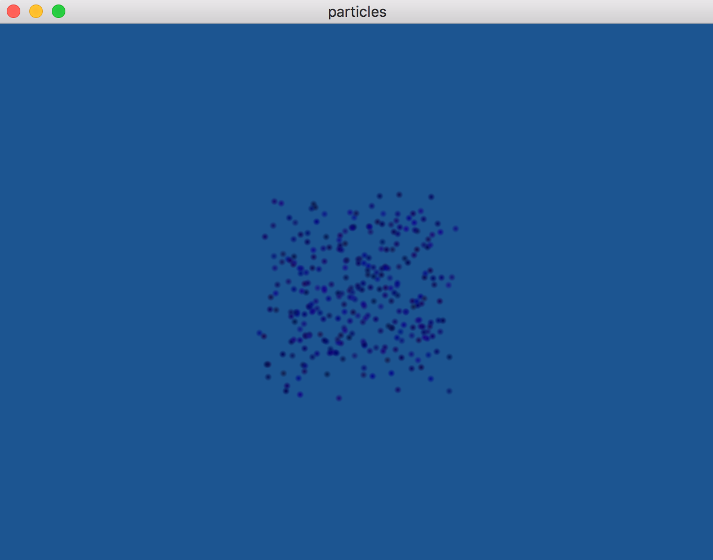
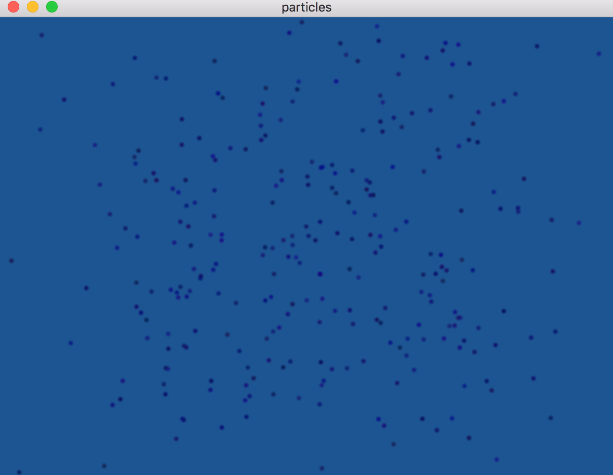

## Particles

This lab allows you to play with a very simple particle system.

### Task:

Download the base code and familiarize yourself with its main functionality.
In general, it is an instanced point sprite implementation of particles.
The program includes 300 particles that are each texture mapped with the `alpha.bmp` file to make them look like small spark-like elements.

The elements all start at the origin with a negative z value ranging from `-2` to `-3`.
They all have a random velocity and a very simple update to move their position along their velocity for each frame.
The particles are sorted based on their distance to the camera for correct alpha blending.

Sample images of the program running would look as follows:

  

    
  

  

    
  

Your lab assignment is to play with this program as follows:

1. Add a Phong shaded mesh to the scene -
  make sure you render it first for alpha blending and have the particles be positioned relative to the mesh as if their source is somewhere on the mesh -
  (look at the rebirth method in `Particle.cpp`)

2. Modify the particles (via editing `Particle.cpp`) in order for them to appear to continuously emerge from the mesh (consider when the particles are reborn)

3. Modify the particles starting colors to better match your scene

4. Modify the particles velocities to start in a particular primary direction -
  in the below examples the particles primarily start with an upward velocity

5. Add gravity to your system -
  you will need to edit the `update` method in `Particle.cpp` to include acceleration and modify the velocity based on gravity.


