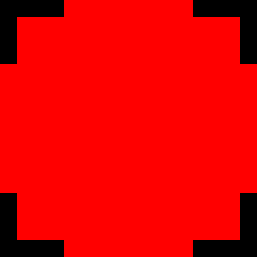
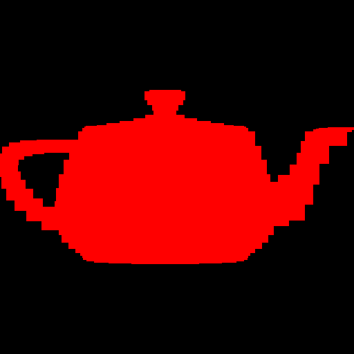
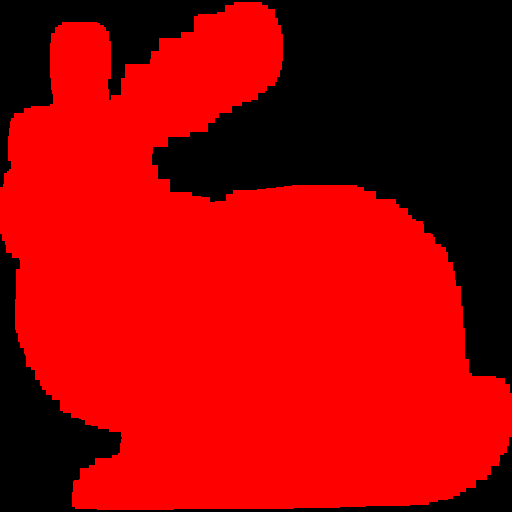
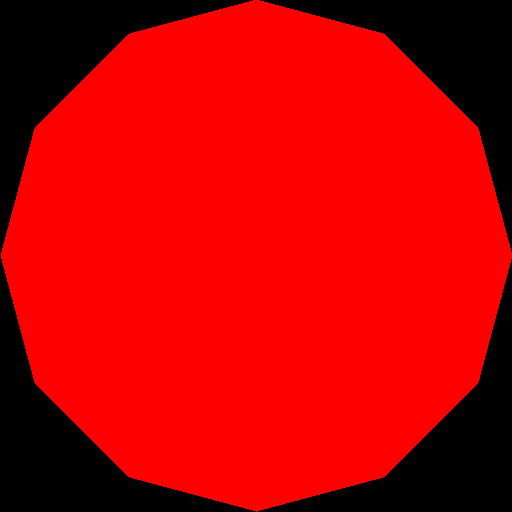
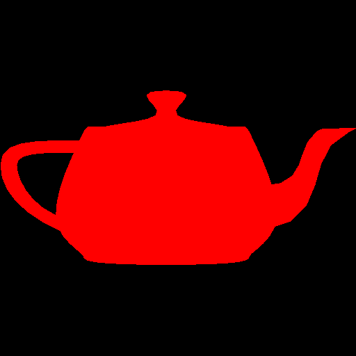
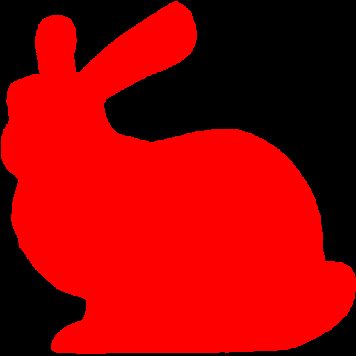
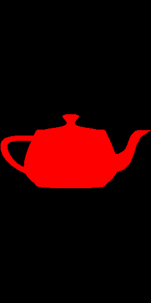
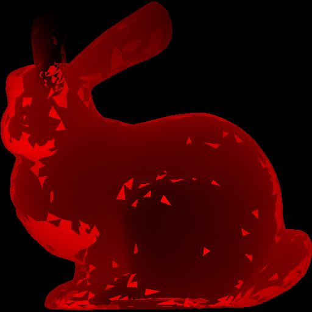
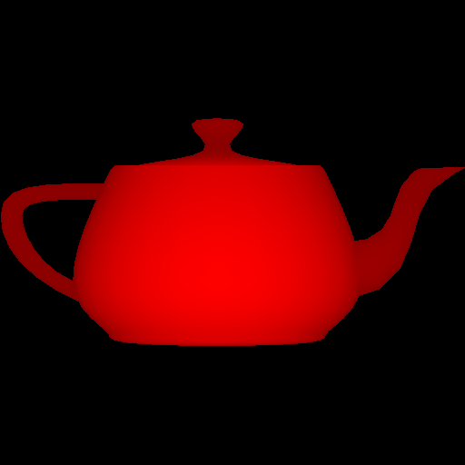
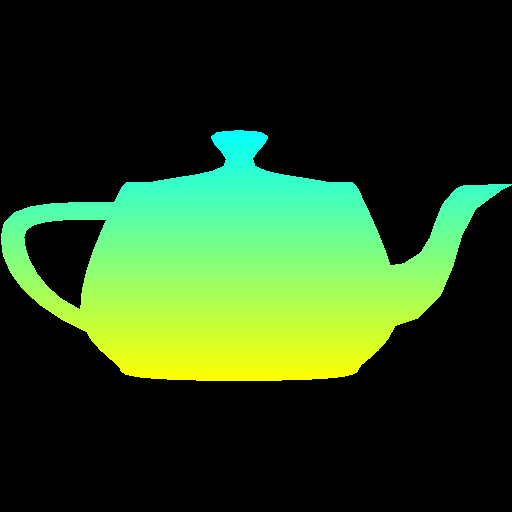

*This is an **individual** project.*


## Goal:

Create a program that reads in and renders an indexed face set meshes (of type .obj) to an image via software rasterization.
You may use existing resources to load in the mesh and to write out an image.
You must write your own rasterizer.
In general the required steps for the program are:

- Read in triangles.
- Compute colors per vertex (using specified method)
- Convert triangles to window coordinates.
- Rasterize each triangle using barycentric coordinates for linear interpolations and in-triangle test.
- Write interpolated color values per pixel using a z-buffer test to resolve depth.


### Task 1:

Download the base code, which has a mesh loader and an image writer from github.

The mesh loader is an obj loader from [http://github.com/syoyo/tinyobjloader](http://github.com/syoyo/tinyobjloader),
and the image writer is the same as the one used in prior labs.

Example mesh files are included in the base code, and you can create your own to represent a single triangle, etc.
In addition, there are numerous OBJ meshes on the web.
For grading purposes, your program will be run using the provided Stanford Bunny and Utah Teapot.

Ultimately you will want each triangle to be represented in a C/C++ structure/class, with 3 vertices and a color per vertex.
In addition, your triangle data should include a 2D bounding box, which will represent the triangle's extents in window coordinates.

### Task 2:

Add a command line argument to accept the following command line arguments.

- Input filename of the .obj file to rasterize
- Output image filename
- Image width
- Image height
- Coloring mode (see Task 5)

For example, your program should be able to be run as follows:

    ./raster ../resources/bunny.obj out.png 512 512 1

Add error checking to specify the required command line arguments if an incorrect number are given –
and include an example correct command line run.
Your program should not dump core if no input file is specified, nor fail without an error message!
Follow the golden rule, treat your user/grader/instructor the way you'd like to be treated as a user/grader/instructor.

### Task 3:

Write code to convert each 3D coordinate into 2D window coordinates.
Assume the camera is at the origin looking down negative z.
Make sure the object completely fills the image.

Some tips for starting out:

- Color everything with a single color (e.g., red, yellow, etc.).
- Create a small OBJ file representing a single triangle.
  Using this small test case, make sure the numbers from the conversion are reasonable.

Write out the bounding box, rather than the triangles, to the image.
If you  do this with the provided sphere, teapot, and bunny, you should see blocky images like below.
Make sure the object looks reasonable in terms of scale and shape.

<div class="row">
  <div class="col-sm-4">
    
  </div>
  <div class="col-sm-4">
    
  </div>
  <div class="col-sm-4">
    
  </div>
</div>

Once the bounding boxes are being displayed correctly, you can add the barycentric test to write out the triangles as in Lab02.
You should not see any gap between the triangles.

<div class="row">
  <div class="col-sm-4">
    
  </div>
  <div class="col-sm-4">
    
  </div>
  <div class="col-sm-4">
    
  </div>
</div>

Make sure you test nonuniform window sizes.
As show below, the aspect ratio of the object should be preserved no matter what the image size is,
and the object should be reasonably scaled.

<div class="row">
  <div class="col-sm-8">
    
  </div>
  <div class="col-sm-4">
    
  </div>
</div>


### Task 4:

The triangles of the objects are in a certain order.

From a certain viewpoint, some triangles might not be visible due to other triangles being in front of them (relative to the camera).
This is called **occlusion**.

You won't notice any problems with this if your triangles are all the same color (as above).

#### Coloring

Incorporate your lab code to rasterize a triangle with a color defined per vertex.
Any point within the triangle should be drawn with colors interpolated via the barycentric coordinates.
Likewise, z (depth) should also be interpolated using the barycentric coordinates and written to the z-buffer.

Use the z value of the vertices as the color.
(You can choose any color, not just red.)
To do this, you have to map the z-value to the range 0 to 255.

You may immediately notice weird results in your render.



This is because some triangles should be **occluded** by others, but whichever triangle is rendered last is the one that actually shows up in front.

We can resolve this using a z-buffer.

#### Z-Buffer

Create a data structure to support z-buffer tests.
Your z-buffer should be a separate buffer from your image pixel buffer, and it should be the same size as your pixel buffer.

For testing if a pixel is in the foreground, you need to compare the z-buffer value on the position of the new pixel:

    If there is none, write the new pixel color and z value.
    If its less (farther away) than the new z value, write the new pixel color and z value.
    If its more (closer), do not overwrite the pixel or z value.


### Task 5

Use the "color mode" command line argument to switch between two modes.
If mode is 1, then use the z-value as in the previous task.
If mode is 2, then use the y-value to linearly interpolate two colors of your choice.
For example, in the right figure below, I am interpolating between yellow and cyan.
Make sure to specify these two colors in your README.
The color should vary smoothly from top to bottom.


<div class="row">
  <div class="col-sm-4">
    
  </div>
  <div class="col-sm-4">
    
  </div>
</div>

### Important Note

Make sure to pass your std::vector by reference rather than by value.

```cpp
void foo(std::vector<float> & bar)
```

Otherwise, your program may become too slow.

And a note about graphics “bugs” - cut and paste errors are SO easy to introduce to your code,
with three coordinates and three colors, etc.
Be sure to re-read your code.
The up side in "bugs" sometimes look cool.
A cut and paste bug that made this cool effect in gradient code...

Read your code!


## Point breakdown

- 20 points for window coordinate transforms for square images.
- 10 points for window coordinate transforms for non-square images.
- 20 points for correct rasterization of triangles.
- 15 points for correct z-buffer implementation.
- 10 points for mode 1 color interpolation.
- 10 points for mode 2 color interpolation.
- 15 points for coding style and general execution. For example, do not put everything in main() .

**Total:** 100 points

## What to hand in

Failing to follow these points may decrease your "general execution" score.
Make sure that your code compiles and runs by typing, for example:

```bash
> mkdir build
> cd build
> cmake ..
> make
> ./raster <ARGUMENTS>
```

Make sure the arguments are exactly as specified.
Include a README file that includes:

- Your name
- The two colors for the second coloring mode
- Citations for any downloaded code (e.g., barycentric)
- Plus anything else of note

Make sure you don't get any compiler warnings.
Remove unnecessary debug printouts.
Remove unnecessary debug code that has been commented out.

Do not commit anything in the `build/` directory, the executable, input obj files,
output image files, old save files (`*.~`), or object files (`*.o`).
