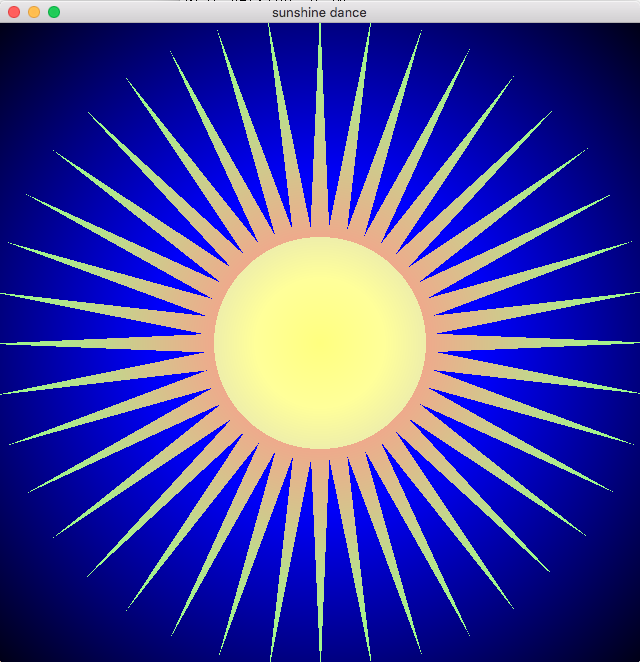
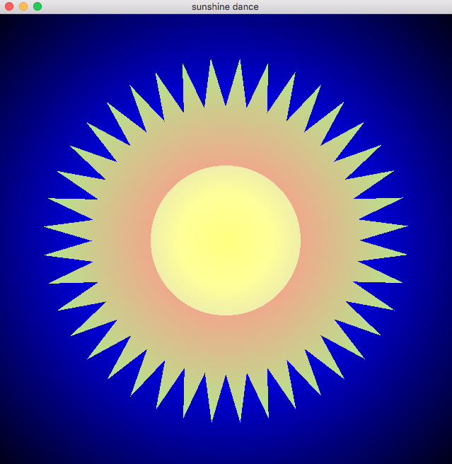
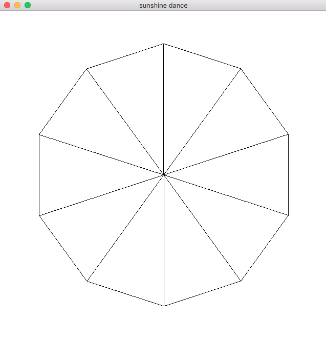
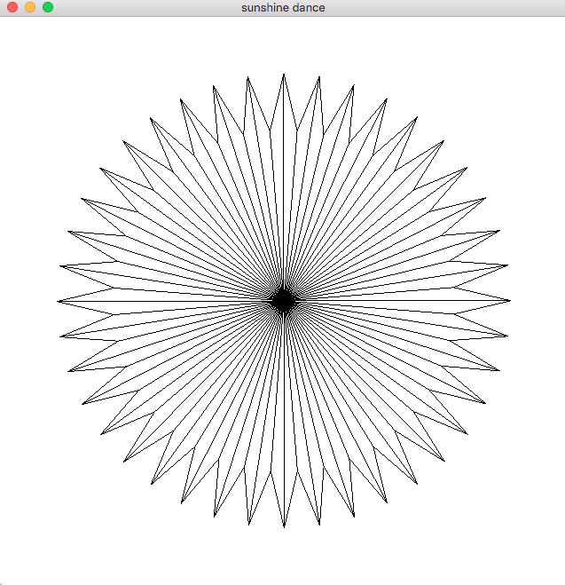
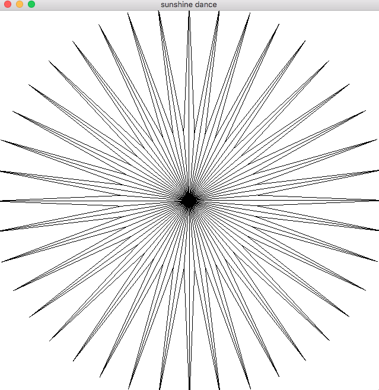
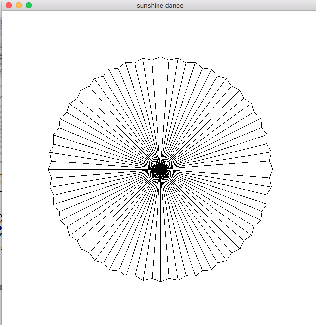
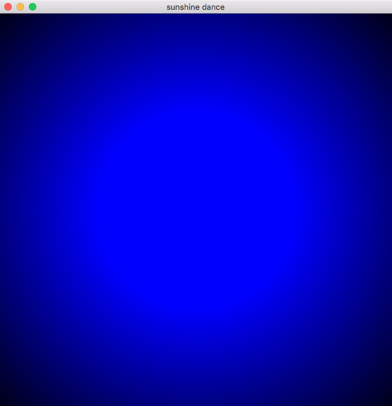

Practice with OpenGL, GLSL data, parametric equations, and vectors

**The goal** of this program is to practice using OpenGL and GLSL in order to
simulate a dancing sun. You will need to manage the generation of the geometry
to represent a circle, passing the data to the GPU and computations on both the
CPU and GPU to create the specific animation and rendering. You will need to
apply your knowledge about simple math and vectors to create the specific
animation. You will also need to add an additional shader to show mastery of
using two different shaders. In general, the vertex shaders will be used to
reposition the points and the fragment shader will be used to control render
attributes of your program.

Your **task** is to make a simple simulation of a sun with dancing rays with a
gradient coloring on both the background and sun. And example frame is
included below as an example and then specific tasks are listed on the following
pages.

Two frames of the animation you will create of a dancing sun:

  

    
  

  

    
  

## Task 1:

Generate the geometry to represent a circle. Using the paramtric equation for a
circle in 2D, generate at least 80 sample points (vertices) around the exterior of a
circle. These vertices should be packed into an array on the CPU as:

`[x0, y0, z0, x1, y1, z1, …., xn, yn, zn]`

make sure to include a vertex for the center of the circle as well, as you will need
to then form triangles (like a pizza). You will then also need to fill in an index
buffer object which specifies which vertices are connected together to make a
triangle. This CPU data, needs to then be passed to the GPU as a vertex buffer
object and index buffer object. For example see below.

  

    
    

      Create vertices and indices and
      fill in a VBO and IBO for a circle with an
      arbitrary number of vertices using a
      parametric equation *you cannot use an
      existing obj – method must be
      procedural
    

  

  

    
    

      Next, sample the triangle with at least
      80 samples and make every other
      vertex offset (like a sun).
    

  

## Task 2:

In the vertex shader write code to update the vertices positions based on
moving in or out from the center of the circle for each vertex

You will need to think about this carefully and add enough data and
computation to the vertex shader to update where the points draw.
Note that the data in the buffer will not actually change, you will just
modify the position sent to `gl_Position` using a vector to represent
the direction of travel and a coefficient to represent how far to travel
along that vector in order to achieve the desired animation.

  

    
    

      Next animate the vertices to
      move in and out over time two frames
      shown here – this frame shows the rays
      in a very spikey mode
    

  

  

    
    

      Another frame of the animation
      showing the rays in a less spikey
      mode
    

  

## Task 3:

Finally modify the fragment shader in order to make the rendering of your
animation more interesting (read about `gl_FragCoord`). You must do several
things:
- Decide on a radius beyond which the rays will draw as a different color
  then the center
- Draw the center and the fragments along the ray as a gradient
- Create a large "background" polygon that when rasterized has each of its
fragments colored based on where that fragment is relative to the center

- Optional: Play with transparency to have the colors of the background and
  foreground blend together in a pleasing way

### Some general comments:

- Consider choosing colors that look good together.
  [Use Abode Kuler to choose colors](https://color.adobe.com/create/color-wheel/).
  [Or Paletton](http://paletton.com/).
- You will likely need to use a **uniform variable** to represent time, which
  changes for every frame.
- You will need to set up two different shaders (each with a pair, vertex and
  fragment shader) – one for the sun and one for the large quad in the
  background – this is good practice for later on when you will want different
  shaders for different elements in your scene.
- You will need to figure out how to complete this assignment using the
  math we learn. Enjoy the puzzle.
- For those with retina displays – you will need to make sure your program
  works on the lab machines. This means you will likely also need to specify
  uniforms for width and height. As `gl_FragCoord` will be relative to your
  retina display (and thus too large/out of bounds on the lab machines).
- For debugging your triangulation, you may want to use
  `glDrawElements(GL_LINE_STRIP, ...`
  instead of `glDrawElements(GL_TRIANGLES, ...`

## Percentage point break down:

- 20% correct generation of vertices and indices for the sun shape
- 30% working animation of sun
- 15% rendering effects for background
- 20% rendering effects on the sun
- 15% general sanity of your code and program execution

