

  <button type="button" class="close" data-dismiss="alert">&times;</button>
  <h4>Warning!</h4>
  

    This content is not fully ready yet.
    The details of the assignment will not change, but build instructions and base code may not yet be available!
  

Build a creature with transforms!

  

    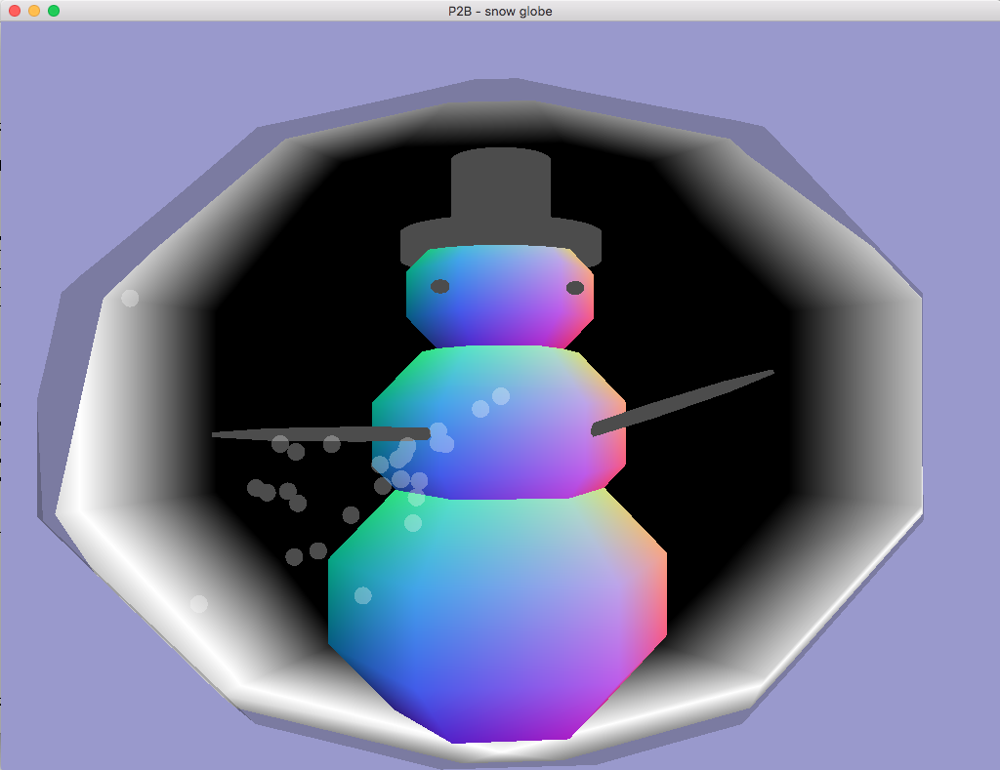
    

      My super simple example
    

  

  

    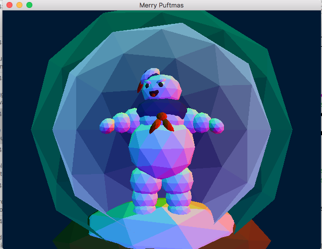
    

      Student example (Fish W 2017)
    

  

  

    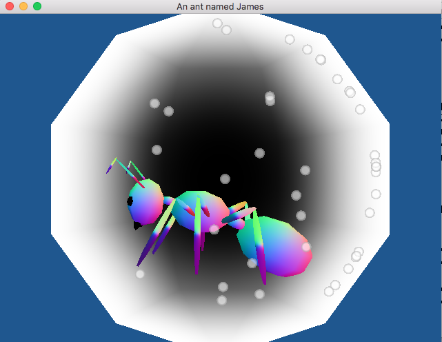
    

      Student example (Zach R. W 2017)
    

  

  

    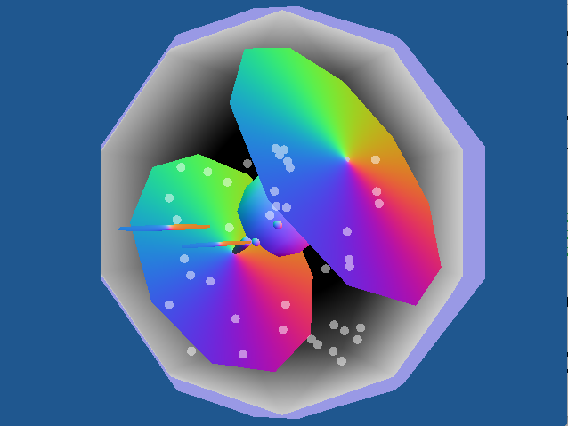
    

      Student example (Zach H. W 2017)
    

  

The goal of this assignment is to practice:

- using transforms in order to create a more complex scene from two simple
  shapes, specifically a sphere and cylinder
- practice creating geometry and packing it into a vertex buffer and index
  buffer (cylinder)
- using vector math to control rendering
- passing data to shaders

For this assignment, you must build an animated scene of a snow globe or creature in a
sphere. Consider starting from your lab 5 and or program 2A code. The tasks required
for this assignment include:

## Step 1

Creating the geometry for a cylinder. Building off of your code to create the
vertices in a circle (from program 2A), create a vertex buffer object (and asso-
ciated index buffer object) to represent a cylinder (the ends do not need to be
closed). For example:

  

    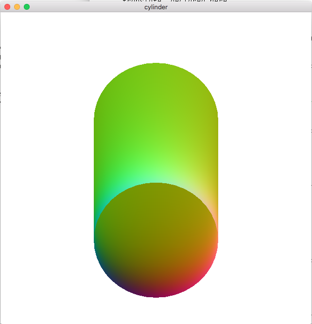
    

      Image of cylinder geometry
    

  

  

    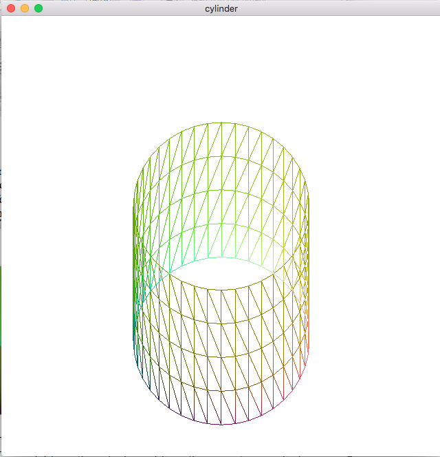
    

      Image of cylinder geometry, showing triangulation
    

  

## Step 2

Building a complex model from the cylinder and from the geometry specified
from an obj file of a sphere. Your final composite model must include at least
seven copies of a mix of the sphere and cylinder, each, which are transformed
differently then the others. For example, the snowman above could be built
with 5 spheres and 2 cylinders. Your transforms must include:

- One non-uniform scale
- One rotation
- One animating element (that animates with respect to the other parts of the
  model – you will likely want to look at the hierarchical modeling slides
  and lab for this component of the program).

Please color your model using the normal of the model as done in lab 5 (note that in order
to provide normal for your cylinder geometry, you can pass a copy of the vertex loca-
tions, think about why this is valid). An example `sphere.obj` file with normal will be pro-
vided. Make your scene look interesting.

## Step 3

Encapsulate the entire scene in one large sphere. You will need to write a shader such
that most of the front facing fragments are not drawn (in order to simulate looking into
the snow globe), however the back faces must be drawn with some color. Consider col-
oring them such that the fragments that are further away are darker. Play with the shad-
ing and your vector math in order to make the snow globe look as realistic as possible.
For the snowman example above, I kept some of the front facing fragments but colored
them with a transparent component.

## Step 4

Add keyboard events for the `a` and `d` key which rotate the entire snow globe, so
that the user can look at the model from different angles. Make sure to update the nor-
mals in order to correctly cull out the faces that now “face” the user.

## Extra Credit

Add snow to your globe by creating a vertex buffer object of random
points that then travel in a circle from their current location in screen space. Use the par-
ametric equation for a circle (and some uniform variable representing time) in order to
animate the snow. Add the snow with a different shader (vertex and fragment).

  

    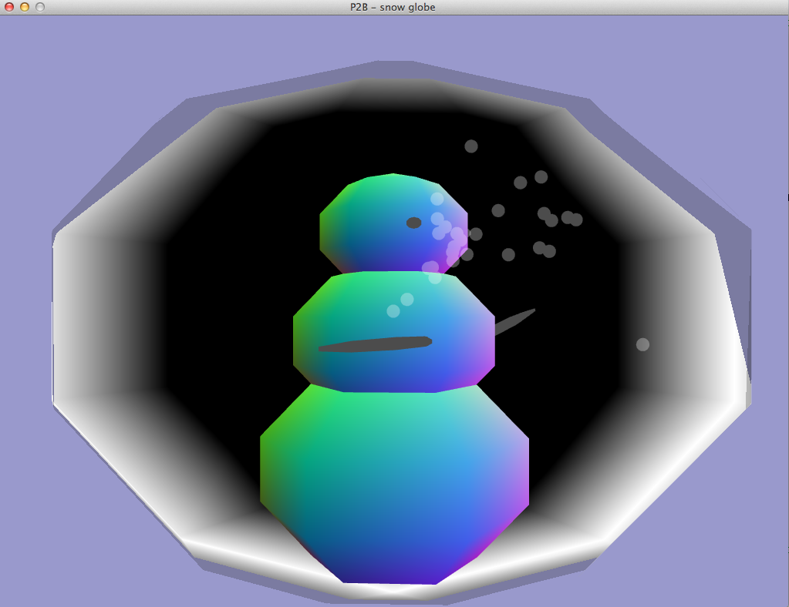
    

      A rotated view of the snow globe
    

  

  

    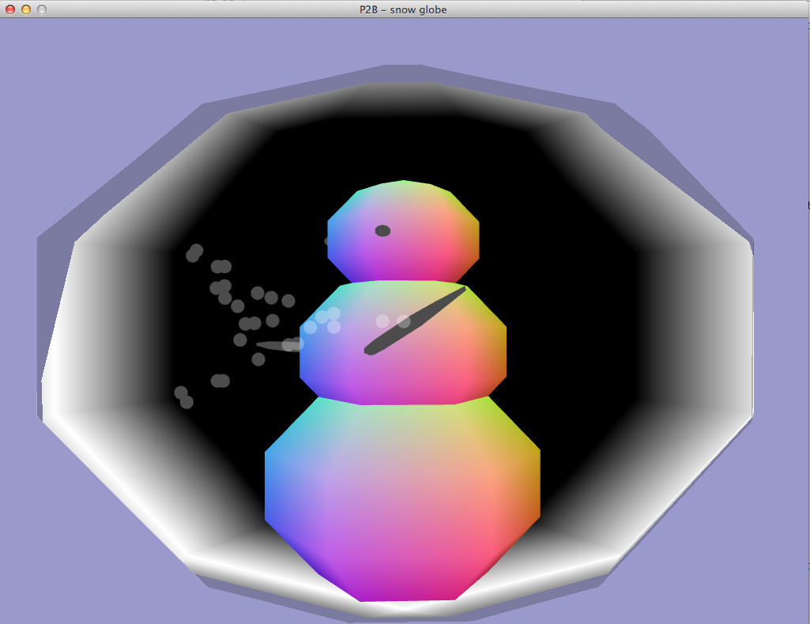
    

      A rotated view of the snow globe
    

  

## Grading

Percentage point break down:

- 20% geometry of a cylinder that you created
- 30% animated model
- 20% snow globe render
- 20% user interaction (global rotate and correct render update)
- 10% general look of model and code sanity
- (0-20%) Extra credit for snow

  

    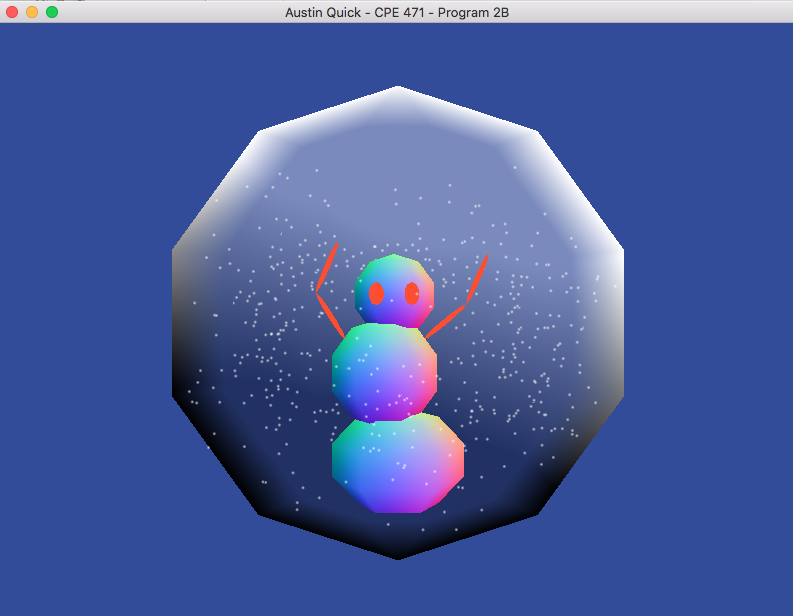
    

      Student example (Austin W17)
    

  

  

    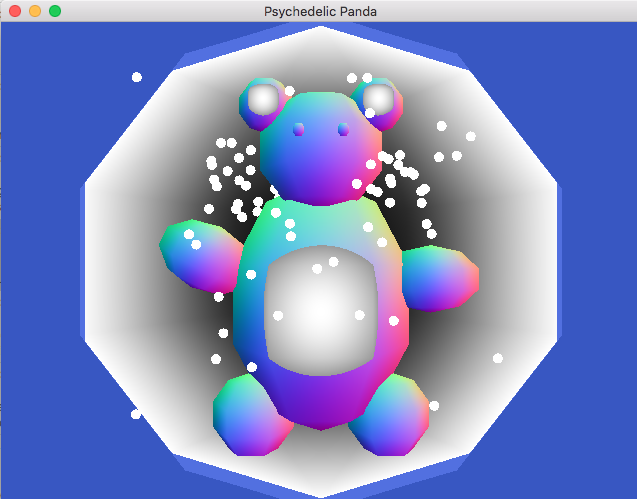
    

      Student example (Tori W17)
    

  

  

    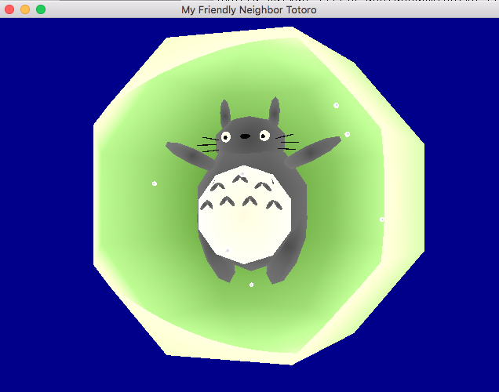
    

      Student example (Rachel S17)
    

  

  

    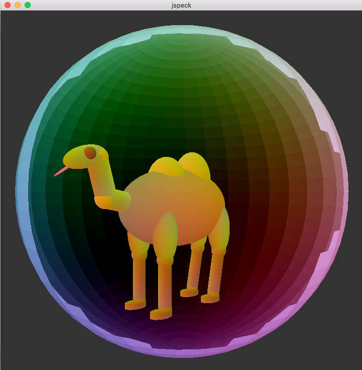
    

      Student example (Jared S17)
    

  

  

    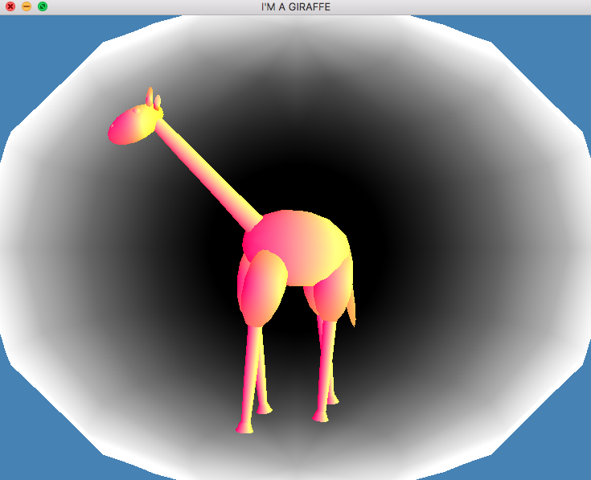
    

      Student example (Rebecca S17)
    

  

  

    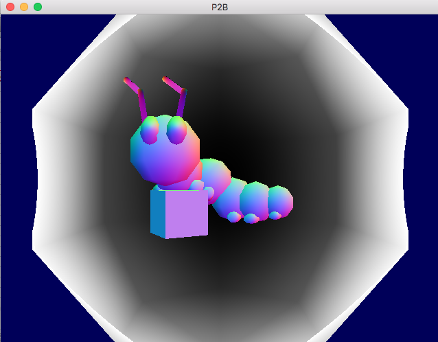
    

      Student example (Jon S17)
    

  

  

    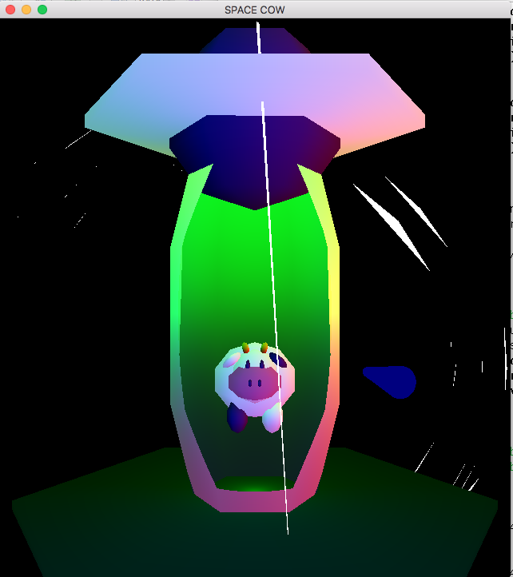
    

      Student example (Bonita S17)
    

  

  

    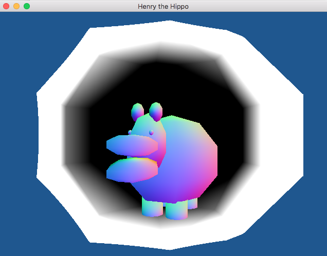
    

      Student example (Jed S17)
    

  

