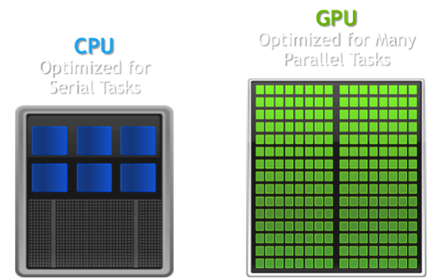

<a href="https://docs.google.com/presentation/d/1D_htUiKc0UhsAPWfNC6GqLFaIGWDT9Q0uGryFbODB9s/edit?usp=sharing" class="btn btn-info">Slide Deck</a>
<a href="https://docs.google.com/presentation/d/1-M4FVo_CUWjC2PGK8w-ykNfbrTZ7kw8ux8bAO1AVE44/edit?usp=sharing" class="btn btn-info">Slide Deck - Dr. Sueda</a>

## About The Class

- Syllabus
  - GradeScope
- Website overview
- Communication and questions
- GitHub Classroom
  - Git usage
- Deadlines and late penalties

Subject Matter

- We will be learning and using C++
- We will be learning and using OpenGL
- We will be using Git to turn things in

Questions:

- Most comfortable programming language?
- Which class would you rather take a math class or drawing class?
- Why are you taking computer graphics?
  - Game development (game industry)
  - Animation (cg industry)
  - Offline rendering (cg industry)
  - Research (academic graphics)

[Quiz Time!](http://area.autodesk.com/fakeorfoto/)

## GPU vs. CPU

## Assignments

- Labs
  - Smaller assignments, checked off in lab
  - Sometimes build pieces for assignments
- Programs
  - Larger assignments, turned in via GitHub Classroom

## Units

- Introduction
  - Build a software rasterizer
  - Start talking about transformations
  - Start talking about geometry and representations
- OpenGL
  - How to use the API
  - The OpenGL Graphics Pipeline
- Transforms
  - More transforms??
  - Hierarchical modeling
- Lighting
  - Shading and lighting
  - Reflection models
  - Color theory
- Camera & Wrap-up
  - Camera controls
  - Scene setup
  - A brief look at common graphics techniques

