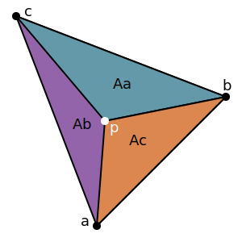

# {{ page.title }}

## Basics

Barycentric coordinates of point $$ p $$ in terms of $$ a $$, $$ b $$, and $$ c $$
are the numbers $$ \alpha $$, $$ \beta $$, and $$ \gamma $$ such that:

$$ p = \alpha * a + \beta * b + \gamma * c $$

A point $$ p $$ is inside the the triangle if and only if:

$$ 0 \leq \alpha \leq 1 $$

$$ 0 \leq \beta \leq 1 $$

$$ 0 \leq \gamma \leq 1 $$

The center of the triangle is $$ \alpha = \beta = \gamma = \frac{1}{3} $$

## Cartesian to Barycentric

Barycentric are a ratio of areas.

Where the total area of the triangle is simply $$ A $$, and each of the points is:

$$ a = \{ x_a, y_a \} $$

$$ b = \{ x_b, y_b \} $$

$$ c = \{ x_c, y_c \} $$

$$ p = \{ x, y \} $$

Given these areas, we can compute the Barycentric coordinates:

$$ \alpha = A_a / A $$

$$ \beta = A_b / A $$

$$ \gamma = A_c / A $$

We can compute these areas using a 2D cross product.

The cross product gives the area of a parallelogram formed by two vectors, so for the area of a given triangle we want $$ \frac{1}{2} $$ of the cross product.

To compute the total area $$ A $$ as:

$$ A = \frac{1}{2} (b - a) \times (c - a) $$

$$ A = \frac{1}{2} \begin{vmatrix}x_b - x_a & x_c - x_a\\y_b - y_a & y_c - y_a\end{vmatrix} $$

To compute the small triangle area $$ A_b $$ as:

$$ A_b = \frac{1}{2} (a - c) \times (p - c) $$

$$ A_b = \frac{1}{2} \begin{vmatrix}x_a - x_c & x - x_c\\y_a - y_c & y - y_c\end{vmatrix} $$

To compute the small triangle area $$ A_c $$ as:

$$ A_c = \frac{1}{2} (b - a) \times (p - a) $$

$$ A_c = \frac{1}{2} \begin{vmatrix}x_b - x_a & x - x_a\\y_b - y_a & y - y_a\end{vmatrix} $$

Computing the determinants is left as exercise for the reader :-)

Finally, we can compute $$ \alpha $$ from $$ \beta $$ and $$ \gamma $$:

$$ \alpha = 1 - \beta - \gamma $$
