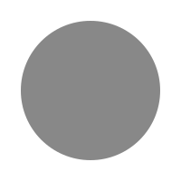
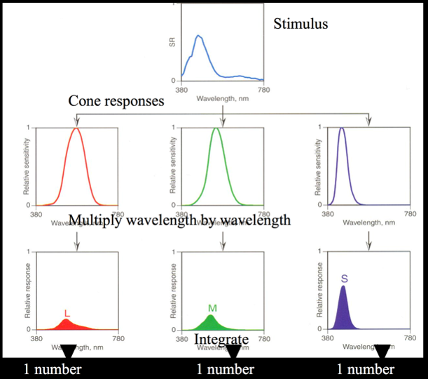
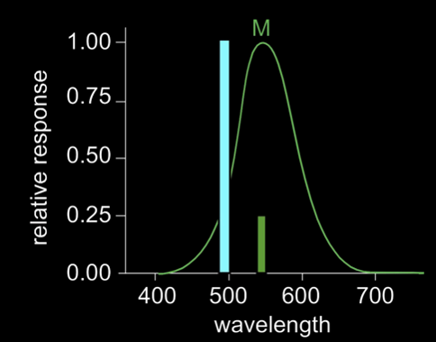
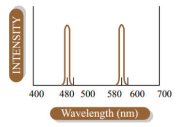
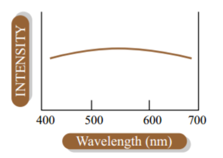

Why do we care about lighting?

Lighting makes things look 3D.

Without lighting:

With lighting:

Some definitions:

**Shading:** the process of assigning a colors to pixels

**Illumination:** the transport of photons from light sources via direct and indirect paths

## Color and Light

**Light** is both a wave and a particle.
That's just some quantum mechanics nonsense.
But in computer graphics we are concerned with some of the details that arise from this.

First, the **wavelength** of this wave tells us the color of the light.
Visible light ranges from 450nm to 700nm.
450nm is  and 700nm is .

Light is characterized by its spectrum: the amount of energy at each wavelength.

This is a full distribution: one value per wavelength (infinite number of values).

To understand light and illumination, we need to understand two things.

**(1)** How does light get to our eyes (what happens on the way)?

**(2)** What happens when light hits our eyes?

Let's talk about the second part, then go back to the first part.

## Color Vision

### Simple and Ultimately Wrong Version

You have red, green, and blue cones.
Red cones see red light, green cones see green light, blue cones see blue light.

If you see  and ,
your brain says "!"

This is a (reasonable) guess based on how yellow is inbetween red and green in the spectrum.

All of , , and  cones? White.

None of the cones? Black.

Just  and ? .

 and ? .

Wait...

Our brains know that something is up when we see red and blue at the same time.
The middle is green... but instead our brain makes up a color.
!

Pink is not on the spectrum.

Pale red and pale violet are... but a mix of these colors is not on the spectrum.

That doesn't mean that Pink isn't a color, though.
Color is just the word we use to describe how our brains interpret light.
Pink is one of the ways that our brain interprets light, so it's a color.
It is called a [non-spectral color](https://en.wikipedia.org/wiki/Spectral_color#Non-spectral_colors).

### Now A More Accurate Version

You have eyes.

In your eyes there are cones.

There are three types of cones but they are not as simple as red, green, and blue.
They are called L, M, and S cones and they each have sensitivity to certain frequencies.

There is some overlap between different sensitivity regions.
But the "cones" don't see anything.
They just relay information to your brain.
Your brain has to take this information and deduce what color you are seeing.

### Cone Response

Light that enters our eyes is (typically) a full distribution of wavelength values.
You can think of this as an infinite number of values, one per each possible wavelength.
Our brain ends up with 3 values, one per cone type.

Note that cones can give the same response for a different wavelength and different intensity.

However, the different cone types will respond differently to this signal.

This is how our brain can figure out the difference between colors.
But it is also clearly not a perfect system.

  By the way, many types of color blindness are caused by either malfunctioning or missing cones of a certain type.
  You can see how this wouldn't necessarily result in an individual being unable to see certain colors,
  but would inhibit their ability to distinguish colors.

  For example, the most common type of color blindness is "Deuteranomaly",
  in which the M or "green" cones sensitivity is shifted slightly towards red.
  Individuals with deuteranomaly can still see red and green, but can have trouble distinguishing them.

Consider the following spectra:

These are clearly different amounts of lights (different spectral power distributions)
and yet they will illicit the same response in our relatively simple color vision system.
Such colors (which match in perception but not in frequency distribution) are called **metamers**.
