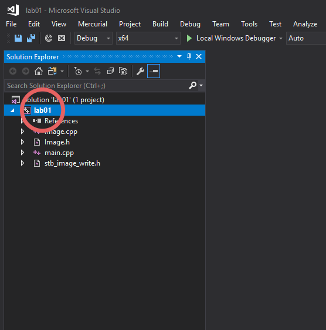
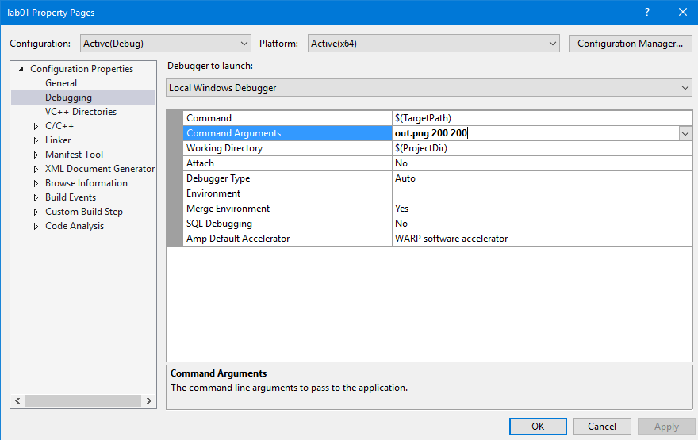

**Visual Studio Solution** files are provided with all base code for ease of use.
There is no reason you can't just do a CMake build on **Windows** just like you would for **Linux** or **OS X**.
However, using the provided solution files will allow you to skip some steps and will generally be easier.

## Installation

If you are working on your own Windows machine, you will have to make sure that you install **Visual Studio 2017**.
Choose the **Community** version.
Make sure that you install **Visual Studio IDE**, not **Visual Studio Code**.
You will also have to specify that you wish to build **C++** projects during the installation process.
On the lab machines, Visual Studio and the C++ Package are already installed.

## Compilation

First, you must open the Solution file.
To build, you can either press **F7** or select `Build -> Build Solution`.

## Commandline Arguments

Setting and changing commandline arguments in Visual Studio can be a little bit tedious.
First, right click on the project in the **Solution Explorer**.
For the first assignment, the project is called `lab01`.
Make sure that you click on the project, not the solution - the solution will usually have the same name as the project.

In the right-click menu, select **Properties** - it's probably at the bottom.
In the **Properties** window, select **Debugging** on the right panel.
Then, in the right panel, you can type in your command arguments.

## Running

To run your program, you can either press **F5** or select `Debug -> Start Debugging`.

If the program exits, the output window (and thus anything printed to standard output or standard error) will close and not be visible.
It's therefore a good idea to but breakpoints on any `return` line in main - that way the program will pause and let you examine the output before it exits.

You can put a breakpoint on a line by placing the cursor on that line and pressing **F9**.
You can also click on the margin to the left of the line in question.
