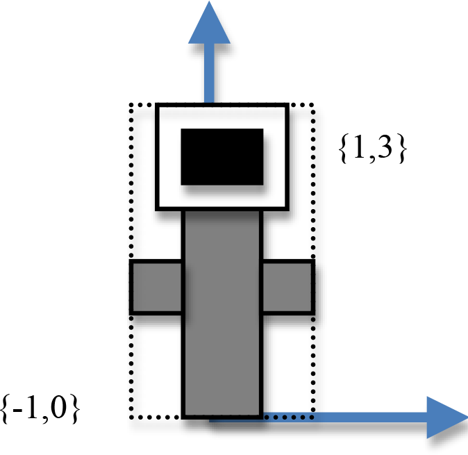

The following topics *could* appear on midterm 1.
This list could shrink or expand (which would be announced in class).

**You will be able to bring one hand written single or double sided sheet of notes into the exam**


### 2D coordinate transforms

- understand in general why we use different coordinate systems (world, image and pixel)
- be able to solve for the scale and translate variables of a mapping from one 2D coordinate system to the next, given corner constraints


### Vectors

- understand how to do vector addition, subtraction, scalar multiplication, dot product and cross product
- understand how to find the angle between two vectors
- understand the difference between a vector and a point
- understand the relationship of vectors, points and planes


### 3D transforms and matrices

- have a general understanding of matrices and matrix/vector operations
- understand what matrices look like for various 2D and 3D transformations, such as translation, scale, rotate and shear
- be able to apply these transforms
- Be able to clearly specify what a composite transform will do to given geometry


### OpenGL/GLSL/glm

- Understand the role of a vertex shader
- Understand the role of a fragment shader
- Understand basic GLSL coding (data passing and computation)
- Understand the basic structure and reasoning for using vertex buffer objects (VBOs) and index buffer objects (IBOs)
- know general OpenGL/GLSL/glm calls for drawing basic primitive types and for applying transformations


### Rasterization

and depth buffer algorithms


## Sample Questions


### 2D Coordinate Transforms

Assume that we have world coordinates defined as follows:

$$ left = -w/h $$

$$ right= w/h $$

$$ top = 3.0 $$

$$ bottom = -3.0 $$


We would like to map these coordinates to pixel coordinates for a window with the following coordinate values:


Assuming that we know that the mapping will contain a scale and translate and thus be of the form:

$$ x_p = c*x_w + d $$

$$ y_p = e*y_w + f $$

Solve for $$c$$, $$d$$, $$e$$, and $$f$$.
Hint: writing out the constraints -
for example we know that when we send left through the mapping we want it to equal $$0$$,
i.e., $$ 0 = c*(-w/h) + d $$

How is the pixel coordinate system different then the world coordinate system?
How do we make sure that a circle in the world coordinate system does not get drawn as an ellipse in the pixel coordinate system?


### Vectors

Given the following vectors:

$$ v^T = \begin{bmatrix}1 & 4 & 6\end{bmatrix} $$

$$ u^T = \begin{bmatrix}0 & 1 & 4\end{bmatrix} $$

$$ w^T = \begin{bmatrix}10 & 3 & 5\end{bmatrix} $$

and the scalar $$ s = 4 $$

Compute:

**1.** $$ v - u $$

**2.** $$ u + w $$

**3.** $$ s * u $$

**4.** $$ v \cdot u $$

**5.** what is the angle between $$v$$ and $$w$$ (don’t compute it just write solution in terms of $$cos$$)

**6.** what is the projection of $$u$$ onto $$w$$

---

Given the points $$ p_0 = \{ 1,  0 \} $$ and $$ p_1 = \{4, 6\} $$
write the implicit equation for a line in vector form (i.e. compute the appropriate $$v$$ and $$n$$).

Is the point $$ p_2 = \{ 1.5, 3 \} $$ on the line or above or below the line?

---

What is the equation for a plane with the normal $$ n^T = \begin{bmatrix}5 & 3 & 4\end{bmatrix} $$ going through the origin?

What is the equation for the planes with the same normal but which include the point $$ p_1 = \{ 4, 6, 7 \} $$?


### 2D Transform Matrices

Given the following 2D transform matrices:

$$ m_0 = \begin{bmatrix}-1 & 0 & 0\\0 & 1 & 0\\0 & 0 & 1\end{bmatrix} $$

$$ m_1 = \begin{bmatrix}0.707 & -0.707 & 0\\0.707 & 0.707 & 0\\0 & 0 & 1\end{bmatrix} $$

$$ m_2 = \begin{bmatrix}1 & 0 & -1\\0 & 1 & -1\\0 & 0 & 1\end{bmatrix} $$

$$ m_3 = \begin{bmatrix}3 & 0 & 0\\0 & 3 & 0\\0 & 0 & 1\end{bmatrix} $$

Name what type of 2D transformation is associated with each matrix and
say something about the magnitude of the transform for x or y or angle, as applicable.

If these are 2D transforms, why are they 3x3 matrices?

**Compute** $$ m_1 * m_2 $$ (that is, write out the composite matrix) and
**Draw** the result of applying the composite matrix to the following figure.
Include coordinate labels for your completed drawing:


### OpenGL / glm

Carefully draw the result of the following glm code assuming that the `DrawFlower()`
function draws the image below without the dashed lines, which are just there to show
you the **size** of the flower (i.e. the bounding box of the flower, ranges from a lower left
corner of $${-1,0}$$ and extends to an upper right corner of $${1,3}$$). Recall that rotations are
specified as counter-clockwise.

**Carefully** read all the code below before drawing.

```cpp
void SetModel(glm::vec3 trans, float sf, float ang, glm::vec3 axis) {
  glm::mat4 Trans = glm::translate( glm::mat4(1.0f), trans);
  glm::mat4 Scale = glm::scale( glm::mat4(1.0f), glm::vec3(sf));
  glm::mat4 Rot = glm::rotate( glm::mat4(1.0f), angle, axis);
  glm::mat4 Model = Trans*Scale*Rot;
  safe_glUniformMatrix4fv(h_uModelMatrix, glm::value_ptr(Model));
}

/* ... */

/*in Draw function */
SetModel(glm::vec3(0), 1, 45, glm::vec3(0, 0, 1));
DrawFlower();
SetModel(glm::vec3(4, 0, 0), 1, -45, glm::vec3(0, 0, 1));
DrawFlower();
```




