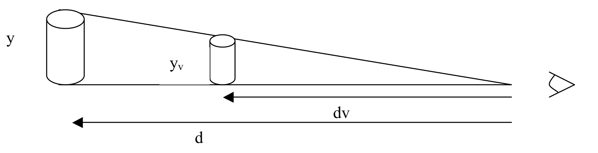
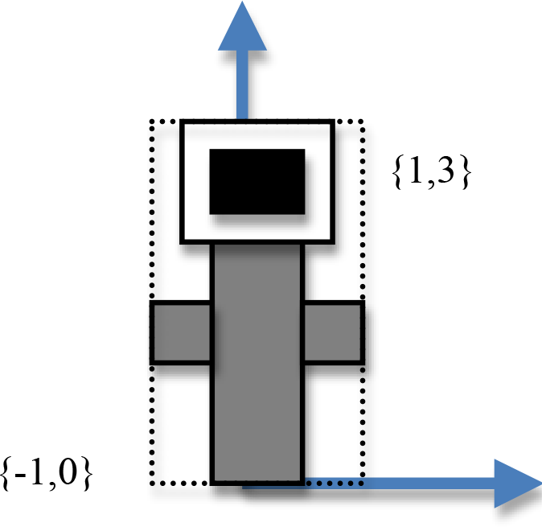

In general, the second midterm will cover the following topics:

1. The graphic pipeline
2. Model transforms
3. Lighting
4. Viewing - including all the viewing transforms and projection models (orthographic and perspective)
  and a general understanding of pitch & yaw camera and strafe and zoom controls
5. Clipping and depth buffer algorithms
6. Geometric relationships, vectors, cross products, plane equations and normal computations
7. Texture mapping

You will be able to bring one single or double sided sheet of notes into the exam.
The following examples should help guide your studies, but actual question format and style will vary.


## Sample questions or thought exercises:

### Illumination (21 pts)

Given a light with the following $$ {r, g, b} $$ ambient, diffuse and specular terms:

- light_diffuse = $$ {0.8, 0.5, 0.5} $$
- light_ambient = $$ {0.1, 0.1, 0.1} $$
- light_specular= $$ {0.2, 0.2, 0.2} $$

and a material with the following ambient, diffuse and specular terms:

- material_diffuse   = $$ {0.9, 0.8, 0.2} $$
- material_ambient   = $$ {0.9, 0.8, 0.3} $$
- material_specular  = $$ {0.9, 0.8, 0.0} $$
- material_shininess = $$ {4} $$

Assuming that the light vector is $$ {8, 0, 6} $$ and the normal is $$ {0, 0, 1} $$
and the view vector is $$ {-3, 0, 4} $$ what is the reflected color $$ {r, g, b} $$,
computed using the Phong model?
(Assume there is no distance attenuation).
**Show your work!**


### Lighting

Understand the difference between per pixel lighting and per vertex lighting

- Compute the reflection vector for `n = [0, 1, 0]`, `l = [3, 2, 0]`:

  

- How is the reflection vector used in lighting computations?

- Given a light with specific ambient, diffuse and specular terms,
  and a material with specific ambient, diffuse and specular terms,
  compute the amount of diffuse relection, specular reflection and ambient reflection
  for a given light position and viewing direction.

- In general, what is the Phong model trying to model - be able to identify the
  different components and say something about what they are modeling (i.e.
  quantity of light and variables that effect the reflected light).

- Know about the different types of materials and how they reflect light differently.


### Texture mapping

- Understand the general process of texture mapping
- Why is texture filtering a problem when texture mapping?


### Viewing

- Know in general what we are trying to accomplish with the viewing transforms –
  what are the different coordinate frames, why are they useful, why can’t we only
  use a matrix to accomplish perspective, What is the difference between
  orthographic and perspective viewing?

- Given an eye position, a look at point and up vector, compute the camera coordinate frame.

  

- If the viewing plane was at distance dv from the camera/eye - what is one way to
  solve for the height of a cylinder at distance d (see picture) projected onto the
  viewing plane using perspective? What would the height be for an orthographic
  projection?


### Clipping & Depth Buffer

- Understand the Cohen and Sutherland clipping algorithm (with specifics given)
- Understand the z-buffer algorithm.


### Graphics pipeline

Draw a simplified version of the graphics pipeline.
What happens roughly at each stage?
Be sure you know what goes into the pipeline and what comes out?


### Geometric relationships & Vectors

- What is the equation for a plane with the normal $$ n = \{ 5, 3, 4 \} $$ going through the origin?
  What is the equation for the plane with the same normal but which includes the point $$ p_0 = \{ 1, 0, -1 \} $$ ?

- What is the normal to a plane that includes the points:

  $$ p_0 = \{ 1, 0, -1 \} $$, $$ p_1 = \{ 2, 4, 1 \} $$, $$ p_2 = \{ 5, 2, 2 \} $$?

- Assume that a Na’vi warrior is flying on a mountain banshee located at $$ \{ 6, 3, 5 \} $$
  and can throw a spear that can only reach anything within a radius of 5.5 miles.

  Currently a bad marine is on top a ship that is located at the following coordinates $$ \{ 2, 3, 2 \} $$.

  Will the Na’vi be able to defeat the marine? SHOW YOUR WORK MATHEMATICALLY!

- Both ship and banshee are speeding through space towards the ground (with a plane equation of $$ 4x + 3y -5 $$).

  What is each’s distance to the ground plane SHOW YOUR WORK MATHEMATICALLY!


### Modeling transforms and OpenGL/glm (18 pts)

(questions similar to midterm 1)

Carefully draw the result of the following glm code assuming that the `DrawFlower()`
function draws the image below without the dashed lines, which are just there to show
you the 'size' of the flower
(i.e. the bounding box of the flower, ranges from a lower left corner of {-1, 0}
and extends to an upper right corner of {1,3}).

Recall that rotations are specified as counter-clockwise.
Carefully read all the code below before drawing.

```cpp
void SetModel(glm::vec3 trans, float sf, float ang, glm::vec3 axis) {
  glm::mat4 Trans = glm::translate( glm::mat4(1.0f), trans);
  glm::mat4 Scale = glm::scale( glm::mat4(1.0f), glm::vec3(sf));
  glm::mat4 Rot = glm::rotate( glm::mat4(1.0f), angle, axis);
  glm::mat4 Model = Trans*Scale*Rot;
  safe_glUniformMatrix4fv(h_uModelMatrix, glm::value_ptr(Model));
}

/* in Draw function */
SetModel(glm::vec3(0), 1, 45, glm::vec3(0, 0, 1));
DrawFlower();
SetModel(glm::vec3(4, 0, 0), 1, -45, glm::vec3(0, 0, 1));
DrawFlower();
```




