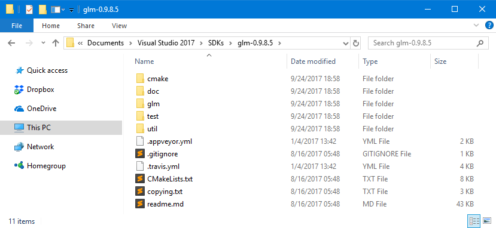
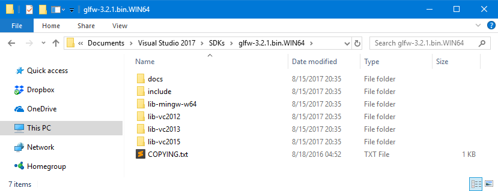

Installing prerequisite software
--------------------------------

In order to build OpenGL applications, a number of **dependencies** need to be installed.
Please skip down to the section relevant to where you will be working.

- Lab machines (Linux)
- Lab machines (Windows)
- Ubuntu Linux
- Max OS X
- Windows

### Lab machines (Linux)

The compiler, CMake, GLM, and GLFW3 should already be installed.
Skip to "Building and Running the Lab/Assignment" below.

### Lab machines (Windows)

Visual Studio is installed, and solution files are provided, but you must install `GLM` and `GLFW3` locally.

First, navigate to `Document` and enter the `Visual Studio 2017` folder.
In this folder, create a folder called `SDKs`.

Next, download `glm-0.9.8.5.zip` at [this location](https://github.com/g-truc/glm/releases/tag/0.9.8.5).
Extract the `glm` folder into your `SDKs` folder, then rename it to `glm-0.9.8.5`.

Finally, download `glfw-3.2.1.bin.WIN64.zip` at [this location](https://github.com/glfw/glfw/releases/tag/3.2.1).
Extract the `glfw-3.2.1.bin.WIN64` folder into your `SDKs` folder.

Skip to "Building and Running the Lab/Assignment" below.

You should see something like this if the folders are named/copied correctly:

{:class="img-thumbnail"}

{:class="img-thumbnail"}

### Ubuntu Linux

You'll need the following if you don't have them already.

	> sudo apt-get update
	> sudo apt-get install g++
	> sudo apt-get install cmake
	> sudo apt-get install freeglut3-dev
	> sudo apt-get install libxrandr-dev
	> sudo apt-get install libxinerama-dev
	> sudo apt-get install libxcursor-dev
	> sudo apt-get install libglfw3-dev
	> sudo apt-get install libglfw3-dev

### Mac OS X

You can use homebrew/macports or install these manually.

- Xcode developer tools. You'll need to log in with your Apple ID.
- CMake (<http://cmake.org/download/>)
- [GLM](http://brewformulas.org/Glm)
- [GLFW3](http://brewformulas.org/glfw)

Make sure the commands `g++` and `cmake` work from the command prompt.

### Windows

First, download **Visual Studio Community 2017**.
Make sure to install the **C++ development tools**.

At this point, you can choose to follow the "Lab machines (Windows)" instructions above.

Or, if you would rather do CMake (or if you have a different version of Visual Studio and don't want to change),
follow these steps:

Download these:

- CMake (<http://cmake.org/download/>). Make sure to add CMake to the system
  path when asked to do so.
- [vcpkg](https://github.com/Microsoft/vcpkg)

Make sure the command `cmake` works from the command prompt.

Now use `vcpkg` to install `glm:x64-windows` and `glfw3:x64-windows`.

---

Building and Running the Lab/Assignment
---------------------------------------

### All platforms (except Lab windows)

We'll perform an "out-of- source" build, which means that the binary files
will not be in the same directory as the source files. In the folder that
contains CMakeLists.txt, run the following.

	> mkdir build
	> cd build

Then run one of the following *from the build folder*, depending on your
choice of platform and IDE.

OSX & Linux Makefile
--------------------

	> cmake ..

This will generate a Makefile that you can use to compile your code. To
compile the code, run the generated Makefile.

	> make -j4

The `-j` argument speeds up the compilation by multithreading the compiler.
This will generate an executable, which you can run by typing

	> ./Lab3 ../resources

to run e.g. the Lab 3 base code.

To build in release mode, use `ccmake ..` and change `CMAKE_BUILD_TYPE` to
`Release`. Press 'c' to configure then 'g' to generate. Now `make -j4` will
build in release mode.

To change the compiler, read [this
page](http://cmake.org/Wiki/CMake_FAQ#How_do_I_use_a_different_compiler.3F).
The best way is to use environment variables before calling cmake. For
example, to use the Intel C++ compiler:

	> which icpc # copy the path
	> CXX=/path/to/icpc cmake ..

OSX Xcode
---------

	> cmake -G Xcode ..

This will generate e.g. `Lab3.xcodeproj` project that you can open with Xcode.

- To run, change the target to `Lab03` by going to Product -> Scheme -> Lab03.
  Then click on the play button or press Command+R to run the application.
- Edit the scheme to add command-line arguments (`../../resources`) or to run
  in release mode.

Windows Visual Studio 2017
--------------------------

The provided `.sln` should work out of the box, provided you installed the two dependencies.

- To build and run the project, right-click on e.g. `Lab3` in the project explorer
  and then click on "Set as Startup Project." Then press F7 (Build Solution)
  and then F5 (Start Debugging).
- To add a commandline argument, right-click on e.g. `Lab3` in
  the project explorer and then click on "Properties" and then click on
  "Debugging."

Windows Visual Studio 2015
--------------------------

Or on your own machine, if you would prefer to use CMake.

Use [vcpkg](https://github.com/Microsoft/vcpkg) to install `glfw3` and `glm`.

	> cmake ..

By default on Windows, CMake will generate a Visual Studio solution file,
`Lab00.sln`, which you can open by double-clicking. If you get a version
mismatch, you may have to specify your visual studio version, for example:

	> cmake -G "Visual Studio 14 2015" ..

Other versions of Visual Studio are listed on the CMake page
(<http://cmake.org/cmake/help/latest/manual/cmake-generators.7.html>).

- To build and run the project, right-click on e.g. `Lab3` in the project explorer
  and then click on "Set as Startup Project." Then press F7 (Build Solution)
  and then F5 (Start Debugging).
- To add a commandline argument, right-click on e.g. `Lab3` in
  the project explorer and then click on "Properties" and then click on
  "Debugging."

